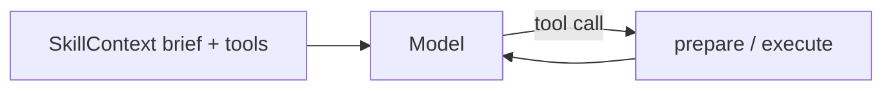

# Skill chaining and registry context

How to combine multiple skills in one host session — model-driven multi-tool routing, host-owned sequential chains, and config-defined named chains.

**Related:** [Agent loops](agent_loops.md), [CLI — context & chain](cli.md#agent-skill-assay-context), [`.skill-assay.yaml.example`](../../.skill-assay.yaml.example)

Skills **never call each other**. The host (your agent loop, script, or `run_chain()`) owns discovery, context assembly, ordering, and each `execute()` call.

---

## Choose your tier

| Tier | Who picks skills | Who picks order | Best for |
| :--- | :--- | :--- | :--- |
| **Single skill** | You | N/A | One tool, one loop ([agent_loops.md](agent_loops.md)) |
| **SkillContext — model routing** | Model (from exposed tools) | Model | Open-ended agents; progressive disclosure |
| **SkillContext — manual chain** | You | Your Python code | Branching, custom error handling, ad hoc pipelines |
| **Named chains (`chains:`)** | You (pick chain name) | YAML steps | Repeatable middleware → domain; CI/scripts |
| **Examples** | Copy from `examples/` | Varies | Provider-specific starter loops |

Use **chain / chains / chaining** for cross-skill host orchestration. Do **not** use framework **`run_pipeline`** (reserved for in-skill actions such as `monitoring/business_diagnostic`).

---

## Choose host context (Directive vs brief)

Choose the host path based on who owns skill selection and when the model needs
the full playbook:

| Scenario | Recommended path | Why |
| :--- | :--- | :--- |
| One dedicated skill | `SkillLoader.load_skill()` + full `bundle["instructions"]` | The model needs the skill's gates and stage order up front |
| Agent exposes about 10 registry tools | `SkillContext(mode="brief")` + `merge_system()` + `tools()` | Brief lines save tokens while schemas carry parameter detail |
| Small fixed skill set (≤ 3) | `SkillContext(mode="directives")` or manual concatenation | Full playbooks fit in the system budget |
| Untrusted text arrives before the model sees it | `run_chain(...)` or a manual chain before the agent loop | The model must not choose middleware order |
| Deterministic middleware (firewall → coaching) | Manual chain or named YAML chain | The host owns the order and branching |
| Full Directive is needed only after tool selection | `prepare()` then host-inject `prep.directive` on the next turn | Progressive disclosure is host-driven |

### Glossary

- **Directive:** the full `instructions.md` playbook for a skill.
- **Brief line:** the `manifest.short_description` summary that `merge_system()` adds in `brief` mode.
- **`SkillContext`:** the host session that discovers skills, exposes provider tools, and prepares or executes selected skills.
- **`prepare()`:** a host-side lazy load that returns `prep.directive`, `prep.manifest`, and `prep.bundle`; it does not change the model system prompt.
- **`context` execute parameter:** session state accepted by a skill's own `execute(params)` contract; it is unrelated to the `SkillContext` host object.

> **Progressive disclosure:** `prepare()` loads the Directive for the host, but it does not inject it into the model prompt. After tool selection, the host must add `prep.directive` to the next model turn, or use `mode="directives"` before the loop. `execute()` auto-prepares and validates skill parameters, but does not inject prompt text.

**Non-goals:** This section does not classify skills in their manifests (see RFC 002) or change the catalog **Usage Examples** format. Catalog examples remain single-skill examples with full instructions.

## Imports

| Need | Import |
| :--- | :--- |
| Registry context (recommended multi-skill entry) | `from skill_assay import SkillContext` |
| Named chain runner | `from skill_assay.chains import run_chain, list_chains, load_chain, validate_chain` |
| Single skill (unchanged) | `from skill_assay.core.loader import SkillLoader` |

`SkillContext` wraps `SkillLoader`; it does not replace it. Existing single-skill scripts keep working unchanged.

---

## SkillContext — discovery filters

`SkillContext` discovers skills the same way as `skill-assay list`, then assembles brief system text, provider tools, and progressive Directive load on `prepare()` / `execute()`.

### Filter matrix

| Goal | Constructor | Example |
| :--- | :--- | :--- |
| **Entire registry** | Default (no filters) | `SkillContext()` |
| **One skill** | `skill=` | `SkillContext(skill="wellness/mental_coach")` |
| **Explicit list** | `skills=` | `SkillContext(skills=["security/prompt_injection_firewall", "wellness/mental_coach"])` |
| **Category(ies)** | `categories=` | `SkillContext(categories=["security", "monitoring"])` |
| **Root tier** | `roots=` | `SkillContext(roots="project")` or `"bundled"`, `"external"`, `"override"` |
| **Custom path** | `roots=` | `SkillContext(roots="/opt/my-skills")` |
| **Exclude tiers** | `exclude_roots=` | `SkillContext(exclude_roots=["external"])` |
| **Optional cap** | `max_skills=` | `SkillContext(max_skills=32)` — emits a warning listing omitted IDs |

Combine filters: `SkillContext(categories=["security"], roots="project", max_skills=10)`.

**Root tiers:** In a dev checkout, skills usually live under `./skills/` (**project**). After `pip install agent-skill-assay` only, skills come from the wheel (**bundled**). Use `roots="bundled"` to limit to packaged skills; use `roots="project"` for local overrides.

There is **no default cap** on registry size unless you pass `max_skills`.

### Context modes

| Mode | System append | Tools | When to use |
| :--- | :--- | :--- | :--- |
| `brief` (default) | One-line summary per skill | Full schemas | Large registries; model picks tools |
| `tools_only` | Nothing | Full schemas | System prompt owned elsewhere |
| `directives` | Full `instructions.md` per skill | Full schemas | Small fixed skill sets (≤ few skills) |

In **`brief`** mode, full Directives are available via `prepare(skill_id)` or on `execute()` — they are not added to `merge_system()` until you use **`directives`** or inject `prep.directive` yourself.

```python
from skill_assay import SkillContext

ctx = SkillContext(categories=["security"], mode="brief")
system = ctx.merge_system(host_system_prompt)
tools = ctx.tools("gemini")   # gemini | claude | openai | deepseek | bedrock
ollama_block = ctx.ollama_prompt  # brief + JSON tool blocks for Ollama prompt mode
# Optional: secret_provider=MappingSecretProvider({...}) or a custom get() for Vault / workload identity
```

CLI mirror:

```bash
skill-assay context show
skill-assay context show --categories security,compliance --roots project --mode brief
skill-assay context show --skill wellness/mental_coach --mode directives
skill-assay context show --export ctx.md
```

### Edge cases

| Situation | Behavior |
| :--- | :--- |
| Skill fails to load at init | Warning on `ctx.warnings`; skill omitted from list |
| `prepare("bad/id")` | `FileNotFoundError` — host must catch |
| `roots="bundled"` in dev checkout | Often empty — local skills live under `./skills/` (**project** tier) |
| `max_skills=N` | Keeps first N IDs (sorted); warning lists omitted skills |
| Invalid `mode` string | Falls back to `brief` |
| `chain dry-run` + step `when:` | Evaluates against resolved params, not real skill output — use live `run_chain()` to test skips |

---

## SkillContext — progressive disclosure (model picks tools)

When the model selects a tool, load the full Directive before or during execution:

```python
from skill_assay import SkillContext

ctx = SkillContext()  # entire registry, brief mode
system = ctx.merge_system("You are a helpful agent with Agent Skill Assay tools.")
tools = ctx.tools("claude")

# ... model returns tool_use for monitoring/business_diagnostic ...

prep = ctx.prepare("monitoring/business_diagnostic")
# prep.directive — full instructions.md text
# prep.manifest — manifest.json
# prep.bundle — loader bundle

result = ctx.execute("monitoring/business_diagnostic", {
    "target_url": url,
    "intended_action": "research documentation",
})
```

- **`execute()` auto-prepares** if you skip `prepare()`.
- **`prepare()`** adds skills outside the initial filter list (lazy expansion).
- **`call()`** is an alias for **`execute()`**.
- One `SkillContext` instance **reuses skill class instances** across calls.

### Host decides the chain (manual Tier 1)

Your code owns branching, retries, and which skill runs next:

```python
from skill_assay import SkillContext

ctx = SkillContext(skills=[
    "security/prompt_injection_firewall",
    "wellness/mental_coach",
])

fw = ctx.execute(
    "security/prompt_injection_firewall",
    {"source_text": raw_html, "input_mode": "html", "sensitivity": "balanced"},
)

if not fw.get("is_safe"):
    # Host policy: block, log, or return firewall output without compressing
    return fw

rw = ctx.execute(
    "wellness/mental_coach",
    {"raw_text": fw["sanitized_text"], "compression_aggression": "medium"},
)
```

For **large documents**, insert `monitoring/business_diagnostic` after the firewall and **before** the main LLM (and optionally before `mental_coach`):

```python
opt = ctx.execute(
    "monitoring/business_diagnostic",
    {
        "document_text": fw["sanitized_text"],
        "agent_goal": "jurisdiction clauses for data handling",
        "max_tokens_return": 2000,
    },
)
# Pass opt["optimized_context"] to the main model; optionally compress further:
# rw = ctx.execute("wellness/mental_coach", {"raw_text": opt["optimized_context"], ...})
```

See `examples/business_diagnostic_chain_demo.py`.

The host can also **choose skills dynamically** (e.g. route to `monitoring/kpi_gate` when a budget flag is set) without YAML — same pattern: `ctx.execute(skill_id, params)`.

### Still using SkillLoader directly

Single-skill loops remain valid ([agent_loops.md](agent_loops.md)):

```python
from skill_assay.core.loader import SkillLoader

bundle = SkillLoader.load_skill("wellness/mental_coach")
skill = bundle["class"]()
result = skill.execute({"raw_text": text, "compression_aggression": "low"})
```

Use `SkillContext` when you need **multiple tools**, **registry brief**, or **shared instances** in one session.

---

## Named chains — predefined YAML pipelines (Tier 2)

Define repeatable order under **`chains:`** in project `.skill-assay.yaml` or global `~/.config/skill_assay/config.yaml`. **Project overrides global** on name clash.

See [`.skill-assay.yaml.example`](../../.skill-assay.yaml.example) for reference chains:

| Chain | Purpose |
| :--- | :--- |
| `sanitize_input` | Firewall → rewriter (rewriter skipped when `is_safe` is false) |
| `optimize_document_context` | Firewall → context optimizer (optimizer skipped when `is_safe` is false) |
| `preflight_untrusted_html` | HTML-mode firewall only |
| `scan_then_gate` | Firewall → token limiter check |
| `deck_build_pipeline` | Validate → lint → render deck spec |

### Python API

```python
from skill_assay.chains import run_chain, list_chains, validate_chain, load_chain

print(list(list_chains().keys()))

validate_chain("sanitize_input", strict=True)  # CI: raises on structural errors

result = run_chain(
    "sanitize_input",
    host_input={"source_text": untrusted_text},
)
# result.status: ok | partial | failed
# result.steps[i].status: ok | skipped | failed
# result.final — last executed step output (firewall output when rewriter skipped)
# result.errors — tuple of error strings
```

### CLI

```bash
skill-assay chain list
skill-assay chain show sanitize_input
skill-assay chain validate              # all chains
skill-assay chain validate sanitize_input
skill-assay chain run sanitize_input --var source_text="hello"
skill-assay chain run sanitize_input --var source_text=@./page.html --json
skill-assay chain dry-run scan_then_gate \
  --var source_text=hello --var task_id=job-1 \
  --var current_token_count=12000 --var max_allowed_tokens=32000
```

`--var key=@file` reads file contents as the value (useful for HTML payloads).

### YAML schema (summary)

```yaml
chains:
  sanitize_input:
    description: Scan untrusted text; compress only if safe.
    when: Untrusted text is about to enter model context.   # human doc for operators
    stop_on_error: true   # default true
    steps:
      - id: scan
        skill: security/prompt_injection_firewall
        params:
          sensitivity: balanced
          input_mode: auto
        input_from:
          source_text: host.source_text
        map_out:
          sanitized_text: next.raw_text
      - skill: wellness/mental_coach
        when:
          prior_step: scan
          field: is_safe
          equals: true
        params:
          compression_aggression: medium
```

### Bindings

| Prefix | Resolves to |
| :--- | :--- |
| `host.<key>` | `host_input[key]` (supports dot paths) |
| `next.<param>` | Next step execute param (via prior step `map_out`) |
| `prev.<field>` | Previous **executed** step output (skipped steps do not update `prev`) |

### Step `when:` (conditional skip)

When the condition is false, the step is **skipped** (not an error). Chain status becomes **`partial`** if any step was skipped and none failed.

```yaml
when:
  prior_step: scan    # step id, 0-based index, or earlier skill_id
  field: is_safe      # dot path in that step's output
  equals: true        # strict equality (v1)
```

If `field` is missing in prior output, the condition is treated as false → skip.

### Host picks which named chain

```python
from skill_assay.chains import list_chains, run_chain

chains = list_chains()
if "preflight_untrusted_html" in chains and content_type == "text/html":
    result = run_chain("preflight_untrusted_html", host_input={"source_text": raw})
else:
    result = run_chain("sanitize_input", host_input={"source_text": raw})
```

The `when:` string on each chain definition is **documentation for operators** (shown in `chain list` / `chain show`), not automatic routing logic.

---

## End-to-end patterns

### Pattern A — Model-routed multi-tool agent



1. `ctx = SkillContext()` or filtered subset.
2. `merge_system()` + `tools(provider)` → model.
3. On tool call: `ctx.execute(skill_id, args)` → return JSON to model.

See [Agent loops — multi-skill sessions](agent_loops.md#multi-skill-sessions-skillcontext).

### Pattern B — Middleware chain in Python

Firewall → domain skill, with host branching (Tier 1 manual chain above).

### Pattern C — Config chain for scripts / CI

`run_chain("scan_then_gate", host_input={...})` or `skill-assay chain run ...`.

### Pattern D — Hybrid

Expose many tools via `SkillContext`, but run a fixed **`sanitize_input`** chain on untrusted ingest before the model sees content:

```python
from skill_assay import SkillContext
from skill_assay.chains import run_chain

sanitized = run_chain("sanitize_input", host_input={"source_text": raw})
text_for_model = sanitized.final.get("sanitized_text") or sanitized.final.get("compressed_text") or raw

ctx = SkillContext(categories=["compliance"])
# ... agent loop with text_for_model as user content ...
```

---

## Provider loops and examples

Runnable reference scripts:

| Pattern | Example |
| :--- | :--- |
| `SkillContext` + Gemini | [`examples/skill_context_gemini_loop.py`](../../examples/skill_context_gemini_loop.py) |
| Named chain (local) | [`examples/sanitize_input_chain_demo.py`](../../examples/sanitize_input_chain_demo.py) |
| `SkillContext` + Ollama | [`examples/ollama_skills_test.py`](../../examples/ollama_skills_test.py) |

Continue with provider guides and single-skill loops:

- [Agent loops](agent_loops.md) — load / wire / prompt / execute / return
- [examples/README.md](../../examples/README.md) — Gemini, Claude, Ollama, OpenAI, Bedrock reference loops
- [Enterprise cloud](enterprise_cloud.md) — Bedrock, Azure OpenAI, Vertex routing

---

## Backward compatibility

| Guarantee | Detail |
| :--- | :--- |
| `SkillLoader.load_skill()` | Unchanged signature and behavior |
| Existing CLI | `list`, `doctor`, `test`, … unchanged; `context` and `chain` are additive |
| No `chains:` in YAML | Config load identical; `config.chains` is `{}` |
| Legacy `chains: { default: [] }` | Ignored safely (no `steps` key) |
| Opt-in only | Nothing runs until you construct `SkillContext` or call `run_chain()` |

---

## Acceptance

This document and the APIs above define the supported skill-chaining guidance for v0.1.
